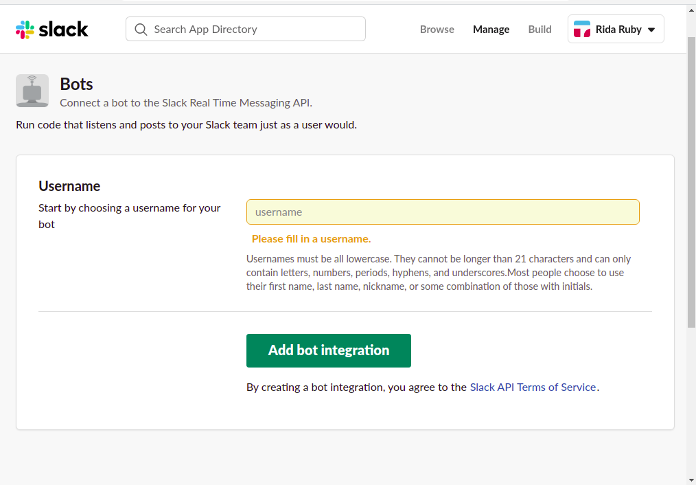
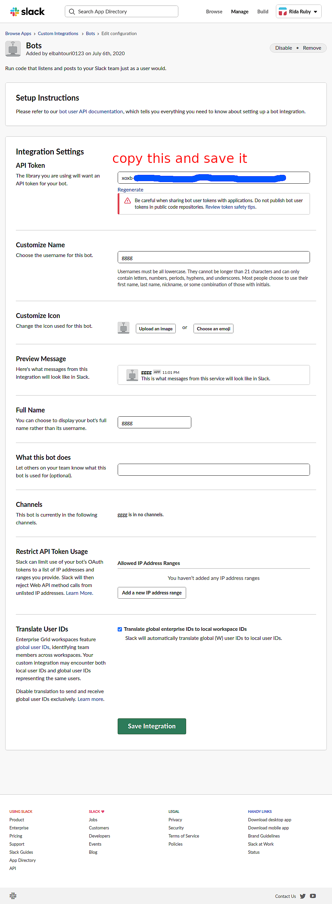
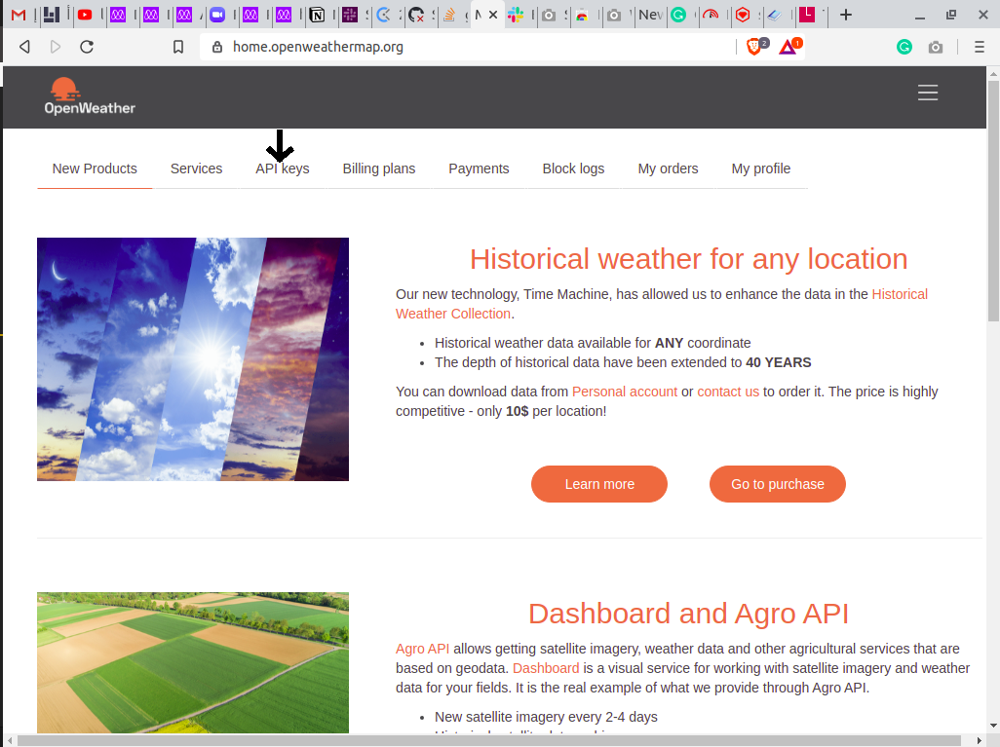
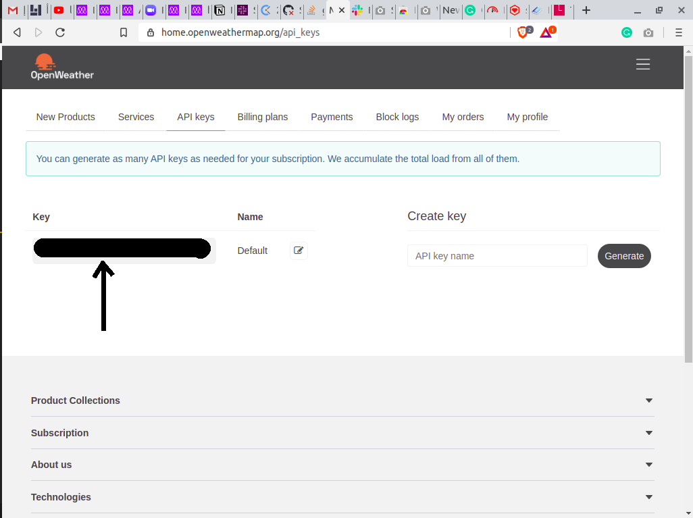

### Slack-bot

This project we add new methods onto the existing Enumerable module. Ruby makes this easy for you because any class or module can be added to without trouble .


## Built With

- ruby 2.7.x
- slack bot ruby
- openweathermap(api)
- type.fit(api)


​
​

### Getting Started
 **First create a new bot on slack**
 [Create Bot](https://ridaruby.slack.com/apps/new)
- Give your Bot a username

- Click on add Bot integration
- Copy and save the Api token

- Click on save integration

**Create an openweathermap account**

- Sign up in here​
​[create weather api](https://home.openweathermap.org/)
- Click on API keys

- Copy your Key and save it

​
**Clone the project**

```bash
# Clone this repository
$ git clone https://github.com/rida-elbahtouri/Slack-bot.git

# Go into the repository
$ cd Slack-bot
```


**Create a .env file**
- add your slack bot and openweather tokens

  SLACK_API_TOKEN = your slack bot token
  
  weather_api = your oprnweathermap token

**Install the gems from Gemfile**
```bash

$ bundle install

```

**Run the app**
```bash

$ rackup

```
**How to use the bot**

[loom video](https://www.loom.com/share/af1e83f0000447df8eb68815ae0eba5b)
### Auther
👤 **Rida Elbahtouri**

- [Github](https://github.com/rida-elbahtouri)
- [Twitter](https://twitter.com/RElbahtouri)
- [Linkedin](https://www.linkedin.com/in/rida-elbahtouri-36a8a7185/)


## �� Contributing

​
Contributions, issues and feature requests are welcome!
​

## Show your support

​
Give a ⭐️ if you like this project!
​

## Acknowledgments

- Slack
- Microverse TSE


## �� License

​
This project is [MIT](lic.url) licensed.
